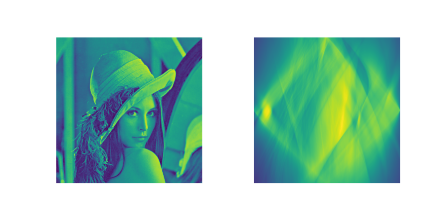

# **Radon transform** | Rust & Python

  

Implementation of the **[Radon transform](https://backend.orbit.dtu.dk/ws/portalfiles/portal/5529668/Binder1.pdf)** in Python and Rust.

The main goal of this repository is to benchmark an algorithmically identical implementation of the Radon transform in Python and Rust.

See [pyradon](https://github.com/alelouis/pyradon) for Python bindings of this implementation.

<p align="center">
  
</p>

## **Benchmark**

```
image_size: 512x512
number of rays: 200
number of slopes: 200
n_trials: 10

python
    mean: 4639.79 ms, var: 0.09
rust
    mean: 23.80 ms, var: 0.57
```

## **How to use**
Run commands below in order to run benchmarks in Python and Rust.
#### Python
```bash
cd py & python benchmark.py
```

#### Rust
```bash
cargo run --bin benchmark --release
```

## **Notes**
As usually done, this radon transform only computes rays with angles going from -pi/4 to pi/4 for numerically stable slopes. In order to compute the complete radon transform, apply the transpose on the transposed image and merge the split transforms.